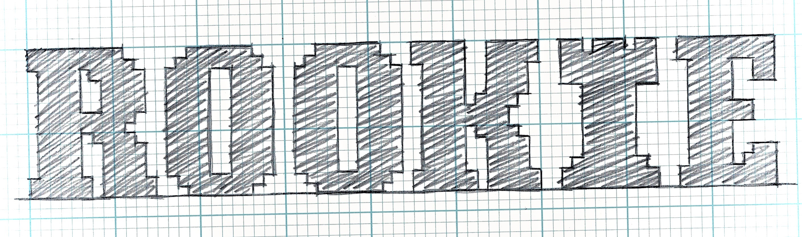

# ✶ ✴ Rookie Chess ✴ ✶

### Rookie Chess is a fun and friendly chess-learning app for kids and other novices.

[Link to repository for the backend](https://github.com/ajsultanov/chess-backend)

> TK demo video/link

#### Made with:
- React
- Redux (mostly)
- Styled Components 💅
- Custom CSS
- Chess.js
- Chessboard.jsx
- Google Fonts
- Rails API
- Postgres

When a user signs in, they have access to their home page, a basic two-player chessboard, and all the current lessons. Lessons contain some combination of _slides_ and _puzzles_. _Puzzles_ come in two varieties: _Examples_ and _Tests_. _Examples_ are simply stepped through by the user similar to the way one can step through a recorded chess game on many sites. _Tests_ are chess problems which must be solved correctly in order to continue (or end) the lesson, and are meant to reinforce the content contained in _slides_. Once a lesson is completed the user gains the relevant amount of XP which is added to their total. On the user's home page their designated "Rank" increases with more XP.

#### Features I would like to add in the future:
- Lessons gated by XP/completion
- More animations
- Customizable boards and pieces
- A lot more lessons!

##### All credit to Catherine for the marvelous name!
